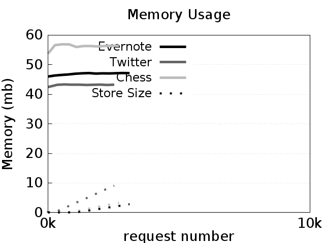
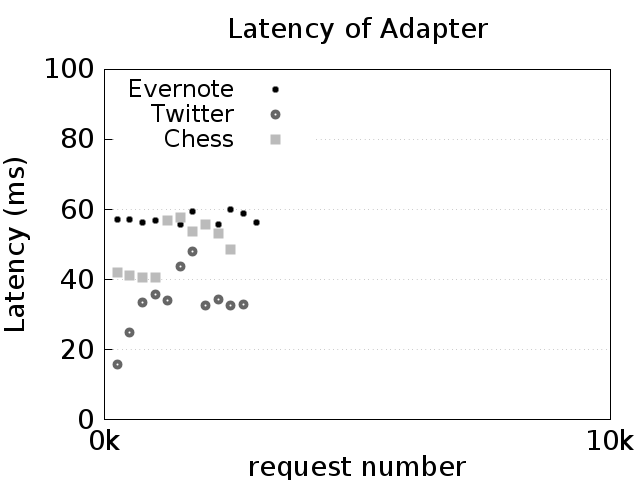
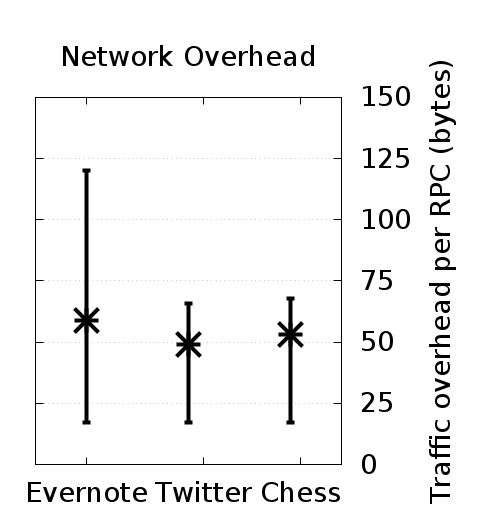

# Benchmarks

In this page we describe the benchmark suite of Whip, what it measures,
and how to run these benchmarks locally.

-> **Note:** This page references details on the design of Whip without introduction. 
If you're unfamiliar with Whip, you may want to try the 
[Demo](https://katacoda.com/wayetender/scenarios/whip-calculator-quickstart) first.


## Overview

Whip comes with a benchmark test suite that contains three real-world
case studies. The case studies are:

* **Evernote**: an Evernote Thrift API client.
	You can find more information about the Evernote API at 
	[https://dev.evernote.com/doc/](https://dev.evernote.com/doc/).
* **Chess**: an SOAP-based Xfcc correspondence chess program. 
	You can find more information about the Xfcc protocol at
	[http://xfcc.org/](http://xfcc.org/).
* **Twitter**: a REST-like Twitter API client.
	You can find more information about the Twitter API at
	[https://dev.twitter.com/overview/api](https://dev.twitter.com/overview/api).

To evaluate how Whip impacts the performance of services it enhances, we designed
our benchmarks to analyze the time, memory, and
network overhead due to Whip. 


### Experimental Setup

We do
not use the actual third-party services for our experiments but instead mock their behavior, i.e., we simulate
their behavior with pre-computed responses for each request. This is for two reasons: 

1. mocking services removes several sources of measurement noise, like service 
	latency variation from background request load, and
2. performing our experiments on third-party production servers violates 
	their terms of use.

We collect the following measurements for each test. First, we record the time to perform each request in
the test suite and receive a reply for (1) the test client alone, and (2) the client enhanced with an adapter. The
difference between these two measurements yields the latency due to the client’s adapter per request (adapter
latency). Second, we record the amount of memory (RAM and hard-disk) used by the client’s adapter. Finally,
we measure the adapter-to-adapter traffic (not including the original request or reply) in the TCP stream. We
measure only the client’s adapter as it is the hub for all communication in each experiment.

Operations that identify a service entry always introduce the service entry (i.e., always use a new contract
index and thus create new service entries in the adapters’ local state, which maximizes local state size). 

## Running the Benchmarks

To run the benchmarks, you will need to have a recent version of Docker (at least
version v1.13.0) installed on your computer. For instructions on downloading
and installing Docker, please see [https://www.docker.com/get-docker](https://www.docker.com/get-docker).

Once Docker is installed,
you will need to clone the Whip repository and the directory we will be 
using is `benchmarks`. You can clone the repository and access that directory 
with the following two commands:

```
$ git clone https://github.com/wayetender/whip.git
Cloning into 'whip'...
...
$ cd whip/benchmarks  
```


#### Directory Structure

The `benchmarks` directory is structured as follows:

```
.
├── docker-compose.yml
├── README.md
├── evernote
│   └── ...
├── chess
│   └── ...
├── twitter
│   └── ...
└── parse_results
    └── ...
```

The benchmarks are run through [Docker Compose](https://docs.docker.com/compose/).
The `docker-compose.yml` file describes the containers that will be run. In
this suite, there are four containers:

* **evernote**: the Evernote test benchmark.
* **chess**: the Chess test benchmark.
* **twitter**: the Twitter test benchmark.
* **parse_results:** parses the raw benchmark outputs to produce human-readable
plots.

The `docker-compose.yml` file is parameterized by the `NUM_OPS` variable, which
sets the number of operations to run per benchmark.

#### Running with Docker Compose

To run the benchmarks, simply set the `NUM_OPS` environmental variable to the
number of operations you want the benchmarks to perform and then run the
`docker-compose up --build` command. Below is an example run and its output
with 1,000 operations per benchmark (3,000 operations in total).

```bash
$ NUM_OPS=3000 docker-compose up --build
Building parse_results
...
Attaching to benchmarks_parse_results_1, benchmarks_twitter_1, benchmarks_evernote_1, benchmarks_chess_1
evernote_1       | Starting tests
evernote_1       | Done
benchmarks_evernote_1 exited with code 0
chess_1          | Starting tests
chess_1          | Done
benchmarks_chess_1 exited with code 0
twitter_1        | Starting tests
twitter_1        | Done
benchmarks_twitter_1 exited with code 0
parse_results_1  | 
parse_results_1  | ---------------------------------
parse_results_1  |       Benchmarks Complete!       
parse_results_1  | ---------------------------------
parse_results_1  | 
parse_results_1  | Please check the results/images directory.
benchmarks_parse_results_1 exited with code 0
```

You can now check the `results/images` directory inside the `benchmarks` directory
to find the following generated images:

<div align="center">
 
 
 
</div>

* `memorychart.png`: 
 	This chart shows the resident set size of the
	adapter and the dashed lines show the sizes of the store on disk.
	In general, the memory usage of the adapters should level off to be
	constant, while the store size (shown in dashed lines) should increase
	linearly.
		
* `throughputchart.png`: This chart shows the latency of the adapter as
	the number of requests increases. Each point is the average of the 250 
	requests around it. In general, the latency of all three benchmarks
	should not increase as the number of requests increases. The variance,
	however, may be high depending on the Docker host machine setup.
* `networkchart.png`: This chart shows the average amount of adapter traffic 
	per operation call. Vertical bars indicate 95% confidence intervals.
	This chart should remain relatively fixed, with Evernote producing roughly 
	75 bytes of overhead on average per operation, and Twitter and Chess producing 
	roughly 50 bytes of overhead per operation.

-> **Note:** With the exception of the `networkchart.png` chart, the generated
results will vary dramatically in absolute numbers depending on the number
of resources given. 

In the ICFP paper, the number of operations chosen was 10,000 (i.e., `NUM_OPS=10000`).
That trial will take about 45 minutes to an hour to complete, depending on the 
resources available to the Docker containers.

## Anatomy of the Benchmarks

In this section, we describe the structure and operation of the benchmarks.

Each benchmark has a common file structure, comprised of the following files:

* `Dockerfile`: This is the description of how to build the benchmark container.
Each container starts from a base Whip container image, and installs benchmark-specific
libraries and copies the source code needed to run the benchmark into the container.
* `run.sh`: This is the script that runs the benchmark. In general, the 
script will wait for a previous benchmark to complete, then start the server
and adapter, then run the test client.
Finally the raw benchmark telemetry is copied to the `results` volume.
* `server.py`: This file contains the mock server implementation and also
starts the adapter in a subprocess (so that it can track its memory usage). 
* `test.py`: This is the test client which which will initiate the client requests
and track end-to-end latency.
* `adapter.yaml`: This is the Whip adapter configuration file. Inspect it to
see what proxies are being set up and how the contracts are wired together
to their network protocols.
* `{BENCHMARK_NAME}.whip`: This is the Whip contract file.

~> For convenience, TLS verification has been disabled on the test clients as it
can be difficult to install certificates on Docker hosts. For more information, 
see the _[Docker documentation on the topic](https://docs.docker.com/engine/security/certificates/)_.
Once the certificate is installed (and placed in the `server.pem` file for the mock server), 
you can remove the verification bypass options in the `test.py` file. 

Each benchmark produces a variety of telemetry data, scattered between multiple programs.
The raw data files are stored centrally in the `results` directory when the benchmark
completes. Within each results subdirectory (given by the name of the benchmark),
the following benchmark raw data files are created:

* `bytes`: Each line corresponds to the number of bytes of Whip-specific information
in an enhanced message. The adapter computes this information (e.g., in 
`whip/src/adapter/frontends/thriftfe.py`) by computing the byte size difference
between the original unenhanced message and the Whip-enhanced message.
* `clientcalls`: Each line corresponds to the number of milliseconds it took
for a client request to complete from beginning to end. The `test.py` test client
computes this information by measuring the delay of invoking an RPC.
* `memory`: Each line corresponds to a periodic reading of the adapter process's 
resident set size (memory usage) and the size of the store file. The file is
comma separated and the columns are, in order, the memory usage of the adapter, 
the file size of the store file, and the number of requests received at the time
of the reading. The `server.py` file computes this information.
* `times`: Each line corresponds to the number of milliseconds it took for
the mock server to respond to a Whip-proxied request. It is similar to the data
in the `clientcalls` file but is only the portion of time the Whip adapter spent
waiting for the server to respond. The adapter computes this information by
measuring the delay of invoking the RPC on the mock server while it is proxying
a client request.

With this information, the `parse_results` container uses the `parse.py` script
to compute the final aggregated and joined data that makes up the resulting
images (computed by the `gen_charts.sh` script). 

